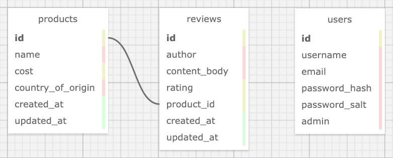

# Mario's Specialty Food Products 
## _Your Source for the Best Quality Food Products!_
### by: Micah L. Olson
### created: 3/17/2021

--- 

## Description
As a **minimum viable product** (MVP) demonstrating knowledge of **Rails with Active Record**, this web application was created to manage products and reviews for a fictional company called *Mario's Speciality Food Products*. The application displays and interacts with a database of available food products and user reviews. Users (admins for now) can add, update and delete new products. They can click an individual product to see its detail page, including its reviews. And they can add, update and delete a review for a product.

---

## Technologies
<table border="0">
 <tr>
    <td width=300px>
      <ul>
        <li>Ruby 2.6.5</li>
        <li>Rails 5.2.4</li>
        <li>rake 13.0.3</li>
        <li>Embedded Ruby (ERB)</li>
        <li>PostgreSQL (psql) 12.6</li>
        <li>pg 1.2.3</li>
        <li>Puma 3.12.6</li>
        <li>Bundler 1.17.2</li>
        <li>Test-Driven Development (TDD)</li>
      </ul>
    </td>
    <td width=300px>
      <ul>
        <li>Faker</li>
        <li>RSpec 3.10</li>
        <li>shoulda-matchers 4.5.1</li>
        <li>Capybara 3.35.3</li>
        <li>Pry 0.14.0</li>
        <li>HTML</li>
        <li>SASS</li>
        <li>Bootstrap-SASS 3.4.1</li>
        <li>git 2.30.1</li>
      </ul>
    </td>
 </tr>
</table>

---

## Requirements
* You will need to use your system's **`terminal` emulator** to set up and locally use this application.

* **`PostgreSQL 12.6`** is required to manage this application's database.  
  <small>
    ([how to install PostgreSQL 12.6](https://www.learnhowtoprogram.com/ruby-and-rails/getting-started-with-ruby/installing-postgres))
  </small>

* You must have **`Ruby 2.6.5`** installed to be able to run this application.  
  <small>
    ([how to install Ruby 2.6.5](https://www.learnhowtoprogram.com/ruby-and-rails/getting-started-with-ruby/installing-ruby))
  </small>

* **`Bundler`** is needed to install all application dependencies. Install it *after* you install `Ruby`.
  ```bash
  $ gem install bundler
  ```

---

## Installation and Setup
* **Clone this repository** to a local directory using the command-line tools `cd` and `git`.  
  <small>
    ([how to install git](https://www.learnhowtoprogram.com/introduction-to-programming/getting-started-with-intro-to-programming/git-and-github))
  </small>
  ```bash
  $ cd ~/<local_directory>/
  $ git clone https://github.com/MicahOlson/marios_food.git
  ```

* **Navigate to the top level directory** of the cloned repository.  
  ```bash
  $ cd marios_food/
  ``` 

* **Install all application dependencies** using `Bundler`.
  ```bash
  $ bundle install
  ```

* **Start the `PostgreSQL` database system** and keep it running while you interact with this application.
  ```bash
  $ postgres
  ```

  * Access the command line again by opening another `terminal` tab. Press and briefly hold these key combinations.  
    `command-t` (macOS) or `control-t` (Windows, GNU/Linux)

  * IMPORTANT! Be sure to **shut the database system down** when you are done using the app.  
    `control-c`

* **Recreate the databases** and **seed** a sample dataset.
  ```bash
  $ rake db:setup
  ```

* The following **database schema** is automatically created by the above command.
  <div>
    
  </div>

* **Launch the local `Puma` web server** to interact with the application in a browser.
  ```bash
  $ rails server
  ```

  * IMPORTANT! Be sure to **shut the web server down** when you are done using the app.  
    `control-c`

* Type **localhost:3000** into your browser's address bar and hit `enter`.

---

## Testing
* This application was created following a **test-driven development** (TDD) process.

* ***Unit* and *integration* test suites** can be found in `spec/models` and `spec/features` respectively.

* **Read the test specs** using `cat` (like below), or open the files in a code editor (see **Code Editors**).
  ```bash
  $ cat spec/models/product_spec.rb
  ```

* **Run the tests** yourself using `RSpec` to verify correct program functionality.
  ```bash
  $ rspec
  ```

---

## Code Editors
* **Recommendations** if you would like to utilize a **GUI** for opening or editing this application's files:
  * [Visual Studio Code](https://code.visualstudio.com) - "Code editing. Redefined."
  * [Atom](https://atom.io) - "A hackable text editor for the 21st Century."
  * [SublimeText](https://www.sublimetext.com) - "A sophisticated text editor for code, markup and prose."

---

## Notes, Bugs, Fixes, and Future Improvements
* No known bugs.
* Feature enhancements are scheduled for 3/26/21.
* If you find a bug, please report it at the email address below.

---

## License
[GPLv3](https://choosealicense.com/licenses/gpl-3.0/)  
Copyright &copy; 2021 Micah L. Olson

---

## Contact Information
Micah L. Olson by 
<a href="mailto:micah.olson@protonmail.com" target="_blank">email</a> 
or at 
<a href="https://www.linkedin.com/in/micah-lewis-olson/" target="_blank">LinkedIn</a>.
